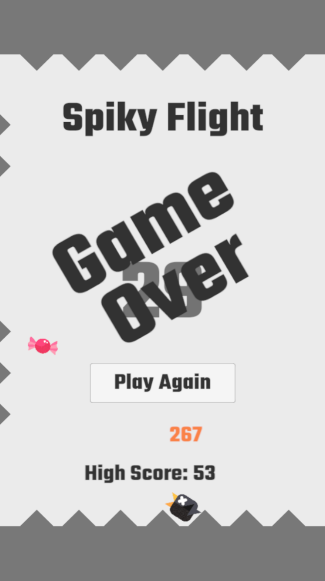

# Spiky Flight

**Spiky Flight** is a 2D mobile game developed in Unity, inspired by the classic ["Don't Touch the Spikes"](https://play.google.com/store/apps/details?id=com.ketchapp.donttouchthespikes).  
This game was created as part of the **Game Engines** course during the Summer Semester 2025 (SoSe25).

## Project Overview

In _Spiky Flight_, the player controls a small bird flying horizontally between two walls. The objective is to avoid randomly placed spikes, which increase in number and complexity as the game progresses.  
Each successful wall bounce earns a point. To enhance gameplay, bonbons appear near the walls and can be collected for extra engagement.

The longer you survive, the more challenging it becomes — pushing players to stay focused and beat their high scores.

## Features

- Gravity-based jumping and smooth horizontal flight
- Randomized spike patterns using predefined prefabs
- Dynamic difficulty based on player score
- Collectible bonbons that alternate sides
- Animated characters and sound effects
- Mobile-friendly UI with responsive screen layout

## Technologies & Tools

- **Engine:** Unity
- **Language:** C#
- **Assets:** Custom-made and free assets

## Challenges & Solutions

### Game Over Detection

Used Unity's collision system to detect when the bird touches a spike, triggering a reliable game-over condition.

### Spike Placement

Instead of full procedural generation, I used a set of pre-designed spike patterns (Prefabs) that scale in difficulty with the player's score.

### Bonbon Spawning

A logic system using flags ensures only one bonbon spawns at a time, alternating sides for fairness and rhythm.

### Screen Size Optimization

Multiple iterations and UI adjustments were necessary to support a wide range of aspect ratios and ensure consistent visual presentation across devices.

## Reflection

I successfully recreated the core mechanics of _Don't Touch the Spikes_, including jumping physics, spike avoidance, scoring, and collectibles.  
With more time, I would refactor the code to distribute responsibilities better—currently, the Bird object handles too many tasks.

## How to Play

To play the game:

1. Unzip the **build folder** included in the repository.
2. Open the unzipped folder and you are ready to go.

---

> This project was developed purely for educational purposes as part of the Game Engines course (SoSe25).
